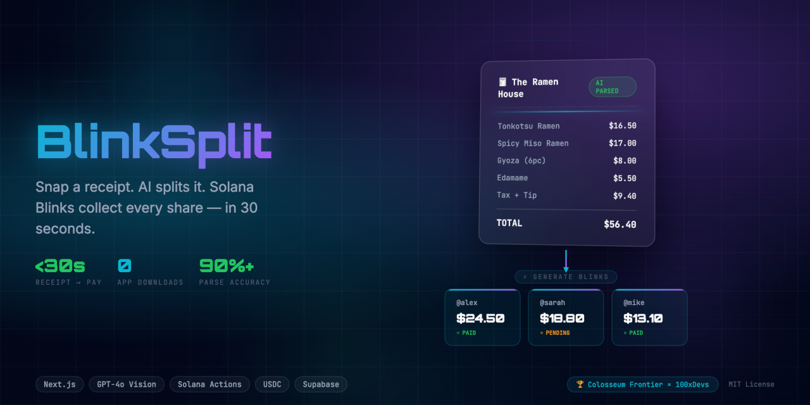
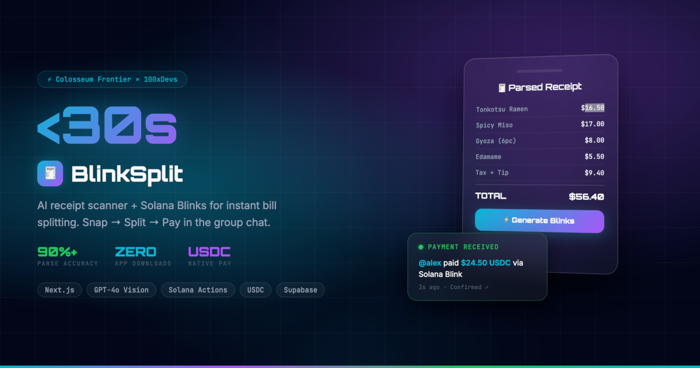

<div align="center">
  
  
  <h3>⚡ BlinkSplit</h3>
  <p><em>AI-powered receipt scanner that generates Solana Blinks — drop a link in the group chat, and everyone pays their exact USDC share instantly.</em></p>
  
  [](https://nextjs.org)
  [](https://solana.com)
  [](LICENSE)
</div>

---

## 📸 See it in Action

<div align="center">
  
</div>

## 💡 The Problem

Your friend owes you $24.50 from last Friday's dinner. You don't want to be awkward about it. You don't want to download another app. You just want to drop a link in the group chat and have everyone pay their exact share — in 10 seconds.

## 🚀 The Solution

**BlinkSplit** — Snap → Split → Pay:

1. **📸 Snap** — Upload a receipt photo
2. **🤖 AI Splits** — GPT-4o Vision extracts every item, tax, and tip
3. **⚡ Blinks** — Generate Solana Action URLs for each person's share
4. **💸 Pay** — Friends click the link and pay USDC. No app download.

The entire flow takes **under 30 seconds**.

## ✨ Key Features

- ⚡ **AI Receipt Scanner** — GPT-4o Vision extracts items, prices, tax, tip as structured JSON
- 🎯 **Split Assignment UI** — Visual interface to assign items to people
- 🔗 **Blink Generator** — Unique Solana Action URLs for each person's share
- 📊 **Payment Tracking** — Real-time dashboard showing paid vs pending
- 💬 **Share via Link** — Drop Blink URLs in WhatsApp, Discord, X — anywhere
- 📜 **Receipt History** — Supabase-stored history of past splits

## 🏗️ Tech Stack

| Layer | Technology |
|---|---|
| **Frontend** | Next.js 16, React 19, Tailwind CSS v4 |
| **AI** | GPT-4o Vision (receipt OCR) |
| **Payments** | Solana Actions / Blinks, USDC |
| **Backend** | Supabase (PostgreSQL + Realtime) |
| **Deploy** | Vercel |

## 🏆 Hackathon

Built for **Colosseum Frontier** — 100xDevs Consumer Track.

## 🚀 Run Locally

```bash
git clone https://github.com/edycutjong/frontier-100xdevs.git
cd frontier-100xdevs
npm install
cp .env.example .env.local   # Add your API keys
npm run dev
```

## 📄 License

[MIT](LICENSE)
