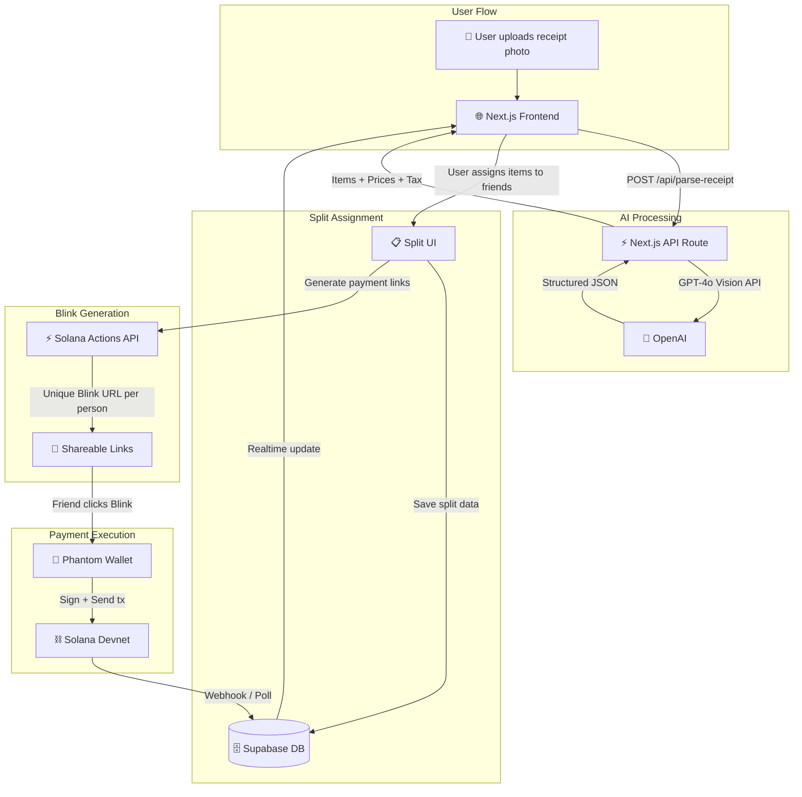

# BlinkSplit — Technical Architecture

## Tech Stack

| Layer | Choice | Why |
|-------|--------|-----|
| **Frontend** | Next.js 16 (App Router) | Your primary stack. SSR for Blink metadata unfurling. |
| **Styling** | Tailwind CSS v4 | Fast iteration, dark mode by default. |
| **AI Backend** | Next.js API Route + GPT-4o Vision | Best OCR accuracy for receipts. Structured JSON output via `response_format`. |
| **Database** | Supabase (PostgreSQL + Realtime) | Real-time payment tracking. Free tier sufficient. |
| **Blockchain** | Solana (Devnet) | @solana/actions for Blink generation. USDC SPL transfers. |
| **Deploy** | Vercel | Zero-config Next.js full-stack deployment. Live URL for judges. |
| **File Storage** | Supabase Storage | Receipt image uploads. |

## System Diagram



## Database Schema (Supabase)

```sql
-- Splits table: one row per receipt scan session
CREATE TABLE splits (
    id UUID PRIMARY KEY DEFAULT gen_random_uuid(),
    image_url TEXT,
    total_amount DECIMAL(10,2) NOT NULL,
    tax_amount DECIMAL(10,2) DEFAULT 0,
    tip_amount DECIMAL(10,2) DEFAULT 0,
    currency TEXT DEFAULT 'USDC',
    status TEXT DEFAULT 'pending' CHECK (status IN ('pending', 'partial', 'completed')),
    created_at TIMESTAMPTZ DEFAULT NOW()
);

-- Split items: individual line items from the receipt
CREATE TABLE split_items (
    id UUID PRIMARY KEY DEFAULT gen_random_uuid(),
    split_id UUID REFERENCES splits(id) ON DELETE CASCADE,
    name TEXT NOT NULL,
    price DECIMAL(10,2) NOT NULL,
    assignee_name TEXT,
    assignee_wallet TEXT,
    created_at TIMESTAMPTZ DEFAULT NOW()
);

-- Payments: one row per person who owes money
CREATE TABLE payments (
    id UUID PRIMARY KEY DEFAULT gen_random_uuid(),
    split_id UUID REFERENCES splits(id) ON DELETE CASCADE,
    payer_name TEXT NOT NULL,
    payer_wallet TEXT,
    amount_owed DECIMAL(10,2) NOT NULL,
    amount_paid DECIMAL(10,2) DEFAULT 0,
    blink_url TEXT,
    tx_signature TEXT,
    status TEXT DEFAULT 'pending' CHECK (status IN ('pending', 'paid', 'failed')),
    paid_at TIMESTAMPTZ,
    created_at TIMESTAMPTZ DEFAULT NOW()
);

-- Enable Realtime for payment status updates
ALTER PUBLICATION supabase_realtime ADD TABLE payments;

-- RLS Policies (open read for MVP, no auth)
ALTER TABLE splits ENABLE ROW LEVEL SECURITY;
ALTER TABLE split_items ENABLE ROW LEVEL SECURITY;
ALTER TABLE payments ENABLE ROW LEVEL SECURITY;

CREATE POLICY "Public read splits" ON splits FOR SELECT USING (true);
CREATE POLICY "Public insert splits" ON splits FOR INSERT WITH CHECK (true);
CREATE POLICY "Public update splits" ON splits FOR UPDATE USING (true);

CREATE POLICY "Public read items" ON split_items FOR SELECT USING (true);
CREATE POLICY "Public insert items" ON split_items FOR INSERT WITH CHECK (true);

CREATE POLICY "Public read payments" ON payments FOR SELECT USING (true);
CREATE POLICY "Public insert payments" ON payments FOR INSERT WITH CHECK (true);
CREATE POLICY "Public update payments" ON payments FOR UPDATE USING (true);
```

## API Endpoints

### Next.js API Routes (Full-Stack)

| Method | Route | Description |
|--------|-------|-------------|
| `GET` | `/api/actions/pay/[paymentId]` | Solana Action GET — returns Blink metadata (icon, title, amount) |
| `POST` | `/api/actions/pay/[paymentId]` | Solana Action POST — constructs and returns serialized USDC transfer tx |
| `GET` | `/api/actions.json` | Actions manifest for Blink discovery |
| `POST` | `/api/splits` | Create a new split session (save parsed receipt data) |
| `GET` | `/api/splits/[id]` | Get split details + payment statuses |
| `PATCH` | `/api/splits/[id]/assign` | Assign items to people |
| `POST` | `/api/splits/[id]/generate-blinks` | Generate Blink URLs for each payer |
| `POST` | `/api/parse-receipt` | Upload receipt image → GPT-4o Vision → structured JSON |

## Key Libraries

| Package | Purpose |
|---------|---------|
| `@solana/actions` | Solana Actions/Blinks SDK — Blink metadata + tx construction |
| `@solana/web3.js` | Solana RPC connection, transaction building |
| `@solana/spl-token` | USDC (SPL token) transfer instructions |
| `@supabase/supabase-js` | Database client + Realtime subscriptions |
| `openai` | GPT-4o Vision API for receipt OCR |
| `recharts` | Payment tracking visualization |
| `framer-motion` | UI animations |

## Sponsor SDK Integration

### Solana Actions/Blinks (Primary Integration)

BlinkSplit is a **pure Solana Actions showcase**. The core value proposition IS the Blink:

1. **`GET /api/actions/pay/[id]`** — Returns `ActionGetResponse` with dynamic icon (receipt thumbnail), title ("Pay your share"), label ("Pay 24.50 USDC"), and amount
2. **`POST /api/actions/pay/[id]`** — Receives payer's `account` (public key), constructs a `VersionedTransaction` with `createTransferCheckedInstruction` for USDC SPL token transfer, returns serialized tx
3. **`actions.json`** — Maps domain URLs to Action endpoints for client discovery
4. **Action Chaining** — After payment confirms, return a follow-up Action showing "Payment confirmed ✅"

### Solana Integration Details

- **Network**: Devnet (with mainnet-ready code)
- **USDC Mint (Devnet)**: `4zMMC9srt5Ri5X14GAgXhaHii3GnPAEERYPJgZJDncDU`
- **Transaction Type**: `createTransferCheckedInstruction` (SPL token transfer, not system transfer)
- **Wallet Support**: Phantom, Backpack, Solflare (any wallet that supports Solana Actions)

## Folder Structure

```
blinksplit/
├── src/
│   ├── app/
│   │   ├── page.tsx                    # Landing / upload page
│   │   ├── split/[id]/page.tsx         # Split assignment + Blink generation
│   │   ├── track/[id]/page.tsx         # Payment tracking dashboard
│   │   ├── api/
│   │   │   ├── actions/
│   │   │   │   └── pay/[paymentId]/route.ts  # Solana Action endpoints
│   │   │   ├── actions.json/route.ts   # Actions manifest
│   │   │   ├── splits/
│   │   │   │   ├── route.ts            # Create split
│   │   │   │   └── [id]/
│   │   │   │       ├── route.ts        # Get split
│   │   │   │       ├── assign/route.ts # Assign items
│   │   │   │       └── generate-blinks/route.ts # Generate Blinks
│   │   │   └── parse-receipt/route.ts  # OCR via OpenAI GPT-4o Vision
│   │   ├── layout.tsx
│   │   └── globals.css
│   ├── components/
│   │   ├── ReceiptUploader.tsx         # Drag-drop image upload
│   │   ├── ReceiptParser.tsx           # Displays parsed items
│   │   ├── SplitAssigner.tsx           # Assign items to people
│   │   ├── BlinkCard.tsx               # Individual Blink preview card
│   │   ├── PaymentTracker.tsx          # Real-time payment status
│   │   └── AnimatedReceipt.tsx         # Receipt scan animation
│   └── lib/
│       ├── supabase.ts                 # Supabase client
│       ├── solana.ts                   # Solana connection + helpers
│       └── types.ts                    # TypeScript types
├── public/
│   ├── logo.svg
│   └── og-image.png
├── .env.local
├── package.json
└── README.md
```
